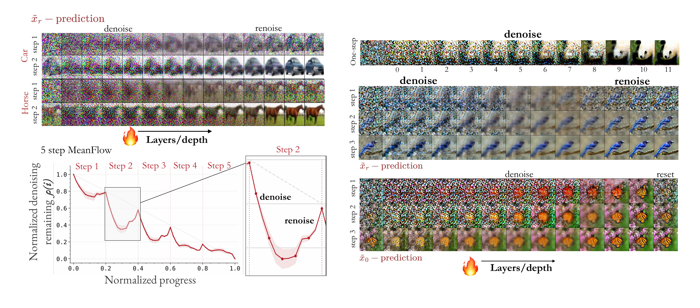

# Depth As Time in One-Step Generative Models

Arnold Caleb Asiimwe · William Yang · Sanghyuk Chun · Esin Tureci · Olga Russakovsky

Princeton University

One-step generative models compress the multi-step trajectory of diffusion into a single forward pass. We find that the denoising computation does not disappear. It reappears across network depth, and decoding intermediate layers with the model's own output head recovers a denoising-like trajectory. We call this **depth as time**. Its form depends on the transport task the model is trained to solve, and models that exhibit it can be compressed into a single time-conditioned block (e.g., a MeanFlow SiT-L/2 compressed 16.6× in parameters).

  

## Code
Code and checkpoints coming soon!
